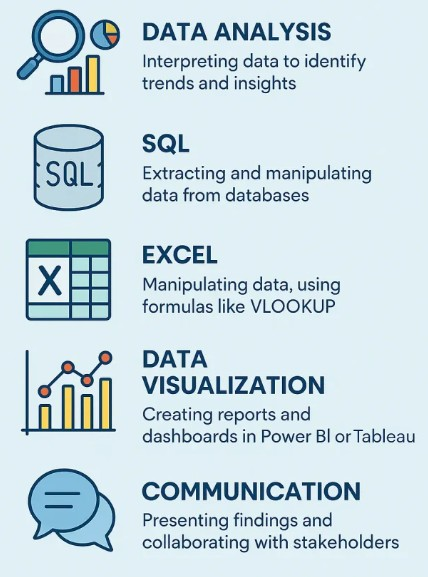

<h3 align="left" id="macropower-title">:wave: Hi, I'm Alberto</h3>
Data Analyst with a degree in Industrial Engineering, focused on turning data into decisions.

I enjoy working on practical data problems — building dashboards, automating reporting, and finding ways to make data actually useful for businesses.

Based in Girona, Spain.

<h3 align="left" id="macropower-title">:rocket: What I Do</h3>

- Build dashboards (mainly with Power BI and Excel)
- Automate reporting processes
- Work with SQL and Python to clean and analyze data
- Explore data to find insights and patterns
- Apply simple machine learning models (forecasting, classification, etc.)    

<h3 align="left" id="macropower-title">:hammer_and_wrench: Tools I Use</h3>

- Power BI
- SQL
- Python (Pandas, Numpy, Scikit-learn)
- Excel
- Power Query, DAX

<h3 align="left" id="macropower-title">:bar_chart: Projects</h3>
Here are some of the things I’ve been working on:  

<!--
<a href="https://github.com/aachaval/Database_MySQL/blob/main/S13_T02_MySQL_Database.ipynb/">SQL practice</a> 
<a href="https://github.com/aachaval/NoSQL_Database/blob/main/S14_T01_%20No_SQL_Database.ipynb">MongoDB</a> 
<a href="https://github.com/aachaval/Unsupervised_Learning-_Clustering/blob/main/S11_T01_Unsupervised_Learning%20_Clustering.ipynb">Clustering practice</a> 
<a href="https://github.com/aachaval/Machine_Learning_Advanced/blob/main/S12_T01_Pipelines_grid_search_and_text_mining.ipynb">Machine Learning practice</a> 
<a href="https://github.com/aachaval/Graphic_Display_Multiples_Variables/blob/main/S03_T02_Graphic_Display_Multiples_Variables.ipynb">Data Analysis</a> 
<a href="https://github.com/aachaval/Clasificacion-erupciones-volcanicas">Clasificación Erupciones Volcánicas - Random Forest Classifier</a> 
-->  

*More coming soon!*  

<h3 align="left" id="macropower-title">:dart: Currently</h3>

- Open to full-time Data Analyst roles
- Open to freelance data projects  

<h3 align="left" id="macropower-title">:love_letter: Let's connect</h3>

  

   

